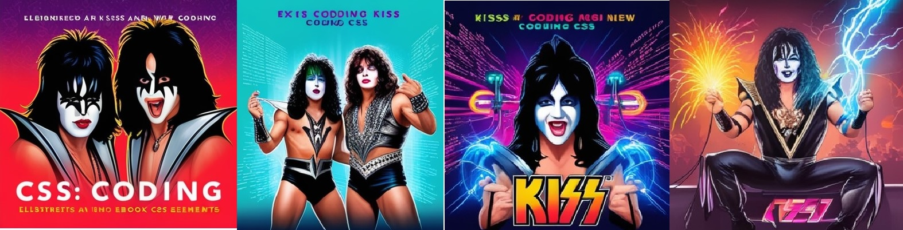
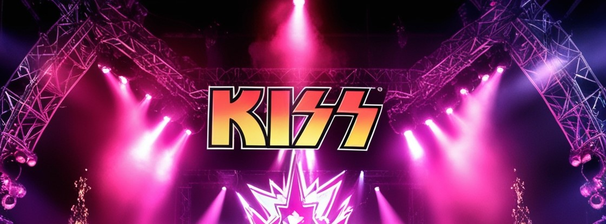

    

-------

# Ebook KISS CSS - Estilizando com Atitude 🤘

 > ℹ️ **OBS.:** Este repositório foi desenvolvido durante o curso Santander 2024 - Fundamentos de IA para Devs do qual fui aluna pela plataforma da [DIO](https://dio.me)

## Projeto EBOOK Gerado por I.A.s 

Projeto com o objetivo de gerar um ebook digital com as facilidades das ferramentas de IA. Os prompts
seguem abaixo.

<a href="https://github.com/felipeAguiarCode/prompts-recipe-to-create-a-ebook/blob/main/output/ebook%20-%20css%20jedi%20output.pdf" title="View PDF now"> 📕Clique aqui para ler</a>

## 💻 Tecnologias utilizadas no projeto

- [ChatGPT](https://chat.openai.com/) 
- [Leonardo AI](https://www.leonardo.ai/)
- [PowerPoint](https://www.microsoft.com/en/microsoft-365/powerpoint)
- [Remini App](https://remini.ai/) 
- [I Love IMG](https://www.iloveimg.com/pt) 

## 🧠 Prompts

### ChatGPT：

### | Ação | Prompt                                                       |
📌|  título  | Crie um título de um ebook sobre o tema de css, o ebook é do nicho de programação e o subnicho é de css, o título deve ser épico e curto, e tenha uma temática da banda Kiss no título, me liste 5 variações de títulos                                                        |
📌| conteúdo | Faça um texto para ebook , com foco em CSS, listando os principais seletores CSS com exemplos em código {REGRAS} Explique sempre de uma maneira simples Deixe o texto enxuto, Sempre traga exemplos de código em contextos reais , sempre deixe um título sugestivo por tópico |

Leonardo IA：

### |  Ação  | prompt |

📌| imagens 1 | Create an electrifying scene inspired by the legendary rock band KISS. The image should capture the essence of their iconic stage presence, featuring the band members in their signature makeup and flamboyant costumes. The setting should be a dramatic stage with intense lighting effects, pyrotechnics, and a roaring crowd. Emphasize the dark, gothic elements with a vibrant, neon color palette. Include the signature elements like Gene Simmons' demon makeup, Paul Stanley's star-studded eye, and the band's logo prominently displayed. The overall vibe should be high-energy, theatrical, and larger-than-life, evoking the power and spectacle of a KISS concert.
Stylistic Elements: Iconic KISS makeup and costumes; Intense stage lighting and pyrotechnics; A roaring crowd; Neon color palette with dark, gothic undertones; Emphasis on theatricality and energy.|

📌| imagens 2 | Create a high-resolution portrait of Gene Simmons, the iconic vocalist of the band KISS, set against a pure white background. Emphasize his signature "Demon" makeup, including the dramatic black-and-white face paint, dark eyes, and exaggerated tongue. His costume should feature the classic spiked armor, black leather, and studded details that reflect his rock persona. Capture the intensity and charisma of his stage presence, focusing on his expressive facial features and powerful gaze. The overall image should be striking, with a sharp contrast between the dark, detailed elements of his appearance and the clean, minimalistic white background.
Stylistic Elements: High-resolution portrait; Gene Simmons' "Demon" makeup; Black leather and spiked armor costume; Clean white background; Sharp contrast and detailed features;
Intense and charismatic expression.|

📌| imagens 3 | Design a series of vibrant, high-energy illustrations inspired by the legendary rock band KISS to be used throughout an eBook about CSS coding. Each illustration should feature the band members in their iconic makeup and flamboyant costumes, set against various backgrounds that reflect the themes of CSS and web design. Incorporate elements such as glowing neon lights, code snippets, and digital effects that seamlessly blend the rock 'n' roll aesthetics with the technical aspects of CSS. Include scenes of the band members performing on stage with electrifying pyrotechnics, coding with intense focus, and interacting with dynamic, futuristic web elements. The overall style should be bold, colorful, and eye-catching, capturing the spirit of KISS while making the technical content engaging and visually appealing.
Stylistic Elements: Iconic KISS makeup and costumes; Neon lights, code snippets, and digital effects; Blend of rock 'n' roll aesthetics with CSS themes; Dynamic scenes of performance and coding; Bold, colorful, and eye-catching visuals.|

📌| imagens 4 | Create high-resolution portraits of the iconic members of the band KISS, set against a pure white background. Each portrait should feature a different band member in their signature makeup and flamboyant costumes. Emphasize the distinct makeup styles of Gene Simmons ("The Demon"), Paul Stanley ("The Starchild"), Ace Frehley ("The Spaceman"), and Peter Criss ("The Catman"). The costumes should reflect their rock persona, with details such as spiked armor, studded leather, and elaborate accessories. Capture the intensity and charisma of their stage presence, focusing on their expressive facial features and powerful gazes. The overall images should be striking, with a sharp contrast between the dark, detailed elements of their appearance and the clean, minimalistic white background.
Stylistic Elements: High-resolution individual portraits; Signature makeup and flamboyant costumes; Pure white background; Sharp contrast and detailed features; Intense and charismatic expressions.|

📌| imagens 5 | Create a high-resolution portrait of Ace Frehley, the iconic guitarist of the band KISS, set against a pure white background. Emphasize his signature "Spaceman" makeup, featuring the silver face paint with black detailing around the eyes and mouth. His costume should include the classic silver and black spandex outfit with star motifs and futuristic accessories. Capture the intensity and charisma of his stage presence, focusing on his expressive facial features and powerful gaze. Incorporate elements such as his guitar, adorned with flashy designs, to highlight his role as a guitarist. The overall image should be striking, with a sharp contrast between the dark, detailed elements of his appearance and the clean, minimalistic white background.
Stylistic Elements:

High-resolution portrait;
Ace Frehley's "Spaceman" makeup
Silver and black spandex outfit with star motifs
Futuristic accessories and guitar
Pure white background
Sharp contrast and detailed features
Intense and charismatic expression

📌| imagens 6 | Create a high-resolution portrait of Peter Criss, the iconic drummer of the band KISS, set against a pure white background. Emphasize his signature "Catman" makeup, featuring the green and black face paint with cat-like details around the eyes and mouth. His costume should include the classic black and silver outfit with studded leather and feline motifs. Capture the intensity and charisma of his stage presence, focusing on his expressive facial features and powerful gaze. Incorporate elements such as his drumsticks and a hint of a drum set to highlight his role as a drummer. The overall image should be striking, with a sharp contrast between the dark, detailed elements of his appearance and the clean, minimalistic white background.

Stylistic Elements:

High-resolution portrait
Peter Criss' "Catman" makeup
Black and silver outfit with studded leather and feline motifs
Drumsticks and hints of a drum set
Pure white background
Sharp contrast and detailed features
Intense and charismatic expression

📌| imagens 7 | Create a high-resolution group portrait of the iconic band KISS, set against a pure white background, suitable for a large poster. Position the band members in a dynamic and powerful pose that captures their legendary stage presence. Emphasize their signature makeup and flamboyant costumes: 
Gene Simmons ("The Demon"): Black-and-white face paint with dark eyes, exaggerated tongue, and spiked armor.
Paul Stanley ("The Starchild"): Star-studded eye makeup, black leather outfit with silver accents.
Ace Frehley ("The Spaceman"): Silver face paint with black detailing, silver and black spandex outfit with star motifs.
Peter Criss ("The Catman"): Green and black face paint with cat-like details, black and silver outfit with studded leather and feline motifs.
Capture the intensity and charisma of their stage personas, focusing on their expressive facial features and powerful gazes. Incorporate elements such as guitars, drumsticks, and hints of musical equipment to highlight their roles within the band. The overall image should be striking, with a sharp contrast between the dark, detailed elements of their appearance and the clean, minimalistic white background. The composition should be bold, dynamic, and visually captivating, perfect for a large, impactful poster.
Stylistic Elements: High-resolution group portrait; Signature makeup and flamboyant costumes for each member;
Dynamic and powerful pose; Guitars, drumsticks, and musical equipment elements; Pure white background; Sharp contrast and detailed features; Intense and charismatic expressions.

## ✨ Features

- Conteúdo gerado via ChatGPT
- Imagens geradas via Leonardo IA
- Remoção de Plano de fundo IloveIMG
- Melhoramento de imagens Remini App

## 📚 Materiais

- Imagens utilizadas em `imagens`
- ebook gerado durante as aulas em `documento`

## 🛠️ Execução

Utilizei os prompts acima nas ferramentas sugeridas durante o curso para gerar o material base e utilizei a ferramenta de edição de documentos power point para diagramação.

## 👨‍💻 Aluna

        
    
&nbsp&nbsp&nbspSimone Penido 
    &nbsp&nbsp&nbsp
    <a href="https://github.com/SimonePenido">
    GitHub</a>&nbsp;|&nbsp;
    <a href="www.linkedin.com/in/
simone-penido">LinkedIn</a>
&nbsp;|&nbsp;
    <a href="https://www.instagram.com/simoneitads/">
    Instagram @simoneitads</a>
&nbsp;|&nbsp;

  

---

⌨️ com 💖 por [Simone Penido](https://github.com/SimonePenido)
